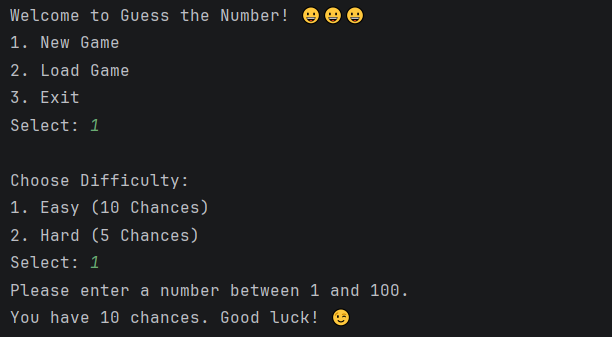
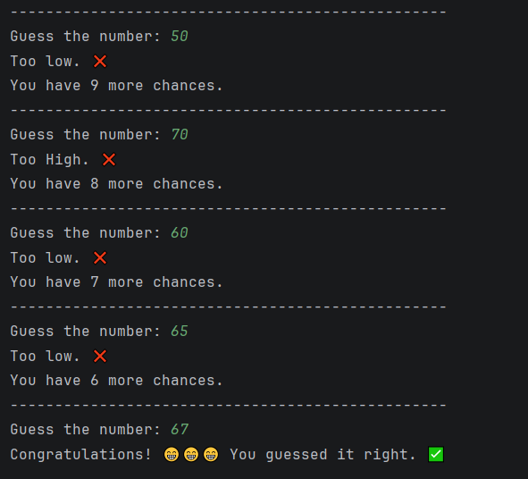
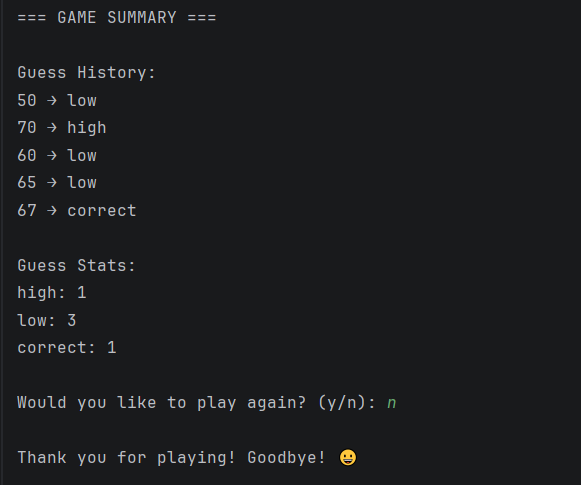

# 🎮 Guess the Number

## Introduction

A terminal-based number guessing game developed during my Python learning journey.

This project started as a simple script and gradually evolved into a small object-oriented application through continuous refactoring, modular design, JSON persistence, and exception handling.

Rather than focusing only on game features, this project emphasizes software engineering practices, including code organization, object-oriented programming, separation of responsibilities, and maintainable project structure.

## Demo







## ✨ Features

- 🎯 Easy / Hard difficulty selection
- 🔢 Guess history tracking
- 📊 Guess statistics
- 💾 Save and load game data using JSON
- ⚠️ Exception handling for missing or corrupted save files
- 🧩 Object-oriented game architecture
- 🗂 Modular project structure
- 🔄 Replay support

## 📁 Project Structure

```
guess-the-number/
│
├── assets/
│   ├── main-menu.png
│   ├── gameplay.png
│   └── game-summary.png
│
├── main.py       # Application controller & game flow
├── game.py       # Game model and game logic
├── ui.py         # Terminal user interface
├── storage.py    # JSON persistence (save/load)
│
├── README.md
├── .gitignore
│
└── old_versions/
    └── v1_modular/
```

Each module has a clear responsibility, making the project easier to understand, maintain, and extend.

The repository preserves the original modular implementation to demonstrate the project's evolution rather than only presenting the final version.

## 🏗 Project Evolution

This project gradually evolved through several refactoring stages:

```
Single Script
        ↓
Functions
        ↓
Modular Design
        ↓
State-Driven Architecture
        ↓
Object-Oriented Programming
        ↓
JSON Persistence
        ↓
Exception Handling
```

The project was continuously improved instead of being rewritten, allowing me to experience the complete evolution of a small software project.


## 🧠 Design Highlights

### Object-Oriented Programming

The project uses a dedicated `Game` class to encapsulate game state and behaviors.

The `Game` object manages:

- random number generation
- guess history
- game statistics
- remaining chances
- round processing

instead of relying on a centralized dictionary.


### Separation of Concerns

Each module has a single responsibility.

| Module | Responsibility |
|---------|----------------|
| `main.py` | Application flow |
| `game.py` | Game state and business logic |
| `ui.py` | User interface |
| `storage.py` | Save and load game data |

This separation makes the code easier to maintain and extend.


### JSON Persistence

Game data is stored as JSON files.

The project supports:

- saving game summaries
- loading previous game data
- reconstructing a `Game` object from JSON


### Exception Handling

The project handles common file-related exceptions gracefully.

Implemented exceptions include:

- `FileNotFoundError`
- `JSONDecodeError`

Instead of crashing, the program provides appropriate feedback and creates a new game when necessary.


## 🛠 Skills Demonstrated

This project helped me practice:

- Python fundamentals
- Object-Oriented Programming (OOP)
- Modular programming
- File handling
- JSON serialization
- Exception handling
- Code refactoring
- Software architecture
- API design
- Separation of concerns


## 🚀 Future Improvements

Possible future enhancements include:

- Save & Exit during gameplay
- Continue unfinished games
- Multiple save slots
- Configuration file
- Improved terminal UI
- Better game statistics


## 📚 Learning Outcome

This project represents my first complete Python software project.

Through continuous refactoring, I learned not only Python syntax but also how to gradually transform a simple script into a more structured and maintainable application.

More importantly, I began to develop software engineering thinking, including object-oriented design, module responsibility, code organization, and project evolution.